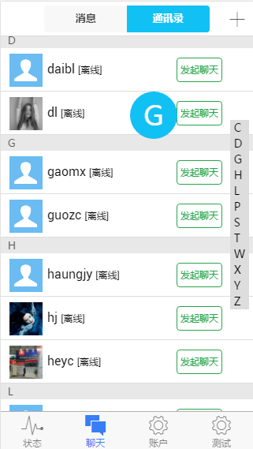

# Ionic-Chat
a chat app based on ionic and rongyun  
> This project is underdevelop and it is unrunnable for the time being. 

## File structure
   ```
   ProjectName/
    ├── hooks/
    ├── node_modules/  
    ├── platforms/ 
    ├── plugins/ 
    ├── scss
    │   ├── ionic.app.scss
    │   └── ...
    ├── www
    │   ├── lib/
    │   ├── assets/
    │   ├── dist/
    │   │    ├── js/
    │   │    │    ├── modulename.min.js
    │   │    │    └── ... 
    │   │    └── css/
    │   │    │    ├── modulename.min.css
    │   │    │    └── ... 
    │   ├── common/
    │   │    ├── css/
    │   │    ├── js/
    │   │    └── tpl/
    │   ├── module/
    │   │    ├── app/ (entry)
    │   │    ├── modulename/ 
    │   │    │    ├── pages/ 
    │   │    │    ├── directives/ 
    │   │    │    ├── css/
    │   │    │    ├── js/
    │   │    │    │    ├── modulename.controller.js
    │   │    │    │    ├── modulename.directive.js
    │   │    │    │    ├── modulename.filter.js
    │   │    │    │    ├── modulename.module.js
    │   │    │    │    ├── modulename.route.js
    │   │    │    │    └── modulename.service.js
    │   │    │    └── tpl/
    │   │    └── ... 
    │   ├── config.js 
    │   ├── index.html
    │   ├── service-worker.js (todo)
    │   └── manifest.json 
    ├──  config.xml
    ├──  ionic.project
    ├──  package.json
    ├──  gulpfile.js
    ├──  bower.json
    ├── .bowerrc
    ├── .editorconfig
    ├── .gitignore
    ├──  README.md
    └──  LICENSE
   ```

## How to build module
In gulpfile you can see this:
```
// chat module for example：
gulp.task('buildchat', function (done) {
  // pack js
  gulp.src([
    'www/module/chat/js/chat.directive.js',
    'www/module/chat/directives/**/*.js',
    'www/module/chat/js/chat.filter.js',
    'www/module/chat/js/chat.route.js',
    'www/module/chat/js/chat.service.js',
    'www/module/chat/js/chat.controller.js',
    'www/module/chat/pages/**/*.js',
    'www/module/chat/js/Controllers/*.js',
    'www/module/chat/js/chat.module.js',
  ])
    // .pipe(uglify())
    .pipe(concat('chat.min.js'))
    .pipe(gulp.dest('www/dist/js'));

  // pack css
  gulp.src([
    'www/module/chat/css/*.css',
    'www/module/chat/pages/**/*.css',
    'www/module/chat/directives/**/*.css',
  ])
    .pipe(concat('chat.min.css'))
    .pipe(gulp.dest('www/dist/css'));
});
```   

just run 
```
gulp buildchat
```
you can get the task done!

## Back-End dependency
you may click [build notes](server/README.md) for more information.   
   
1. node with express
2. mongodb with mongoose
3. rongyun cloud cordova plugin
4. turn/stun server
5. socket.io

## How to run
1. install node
2. set up the enviroment for android/ios
3. install ionic. please follow the instrunction on [ionicframework](http://ionicframework.com/getting-started/)
4. git clone https://github.com/pengkobe/ionic-chat.git
5. cd /path/to/ionic-chat
6. ionic platform add android/ios
7. ionic build android/ios
8. ionic emulate android/ios


## How to run/debug on web browser
looks a little complicated here. just for your purpose of ajusting styles. 
will support one key set soon.
+ userindex.js
```
//initRong.init(user.rongyunToken);
```
  
+ contacts
```
 //init();
 initTest();
```
    
+ chatDetail
```
 // init();
```
  
+ just follow these commands 
```
# notice : you should open your mongodb and redis service first
cd path/to/ionic-chat/server
node bin/www
cd ..
ionic serve 
```

## Doing
1. ~~hot update~~
2. localstorage policy
3. server push 
4. jwt

## Todo
1. lazy load
2. compress js
3. make it beautiful and stable

## Demo
a little glimpse of the app on Chrome:  


## Licence
MIT@[pengkobe](yipeng.info)
